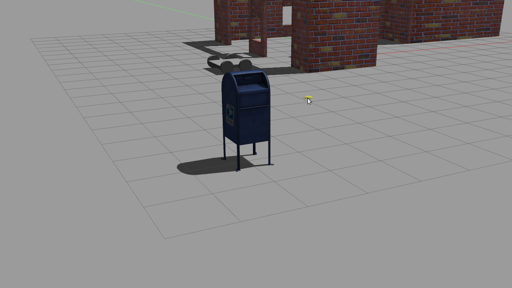

# Robotics ND- Project -Build-My-World

Layout of the simulation world build using gazebo and ros for interacting with simulation world via c++ script

<p align="center"><br/>Welcome C++ Plugin interacting with myWorld Gazebo environment and printing out `Welcome to Rishi's World!`.<br/>Ported postbox model from online Gazebo model repository</p>

## Overview  
Created simulation world in Gazebo as part of my [Udacity Robotics Software Engineer Nanodegree Program](https://www.udacity.com/course/robotics-software-engineer--nd209).  
1. Built a single floor wall structure using the **Building Editor** tool in Gazebo. Applied at least one feature, one color, and  one texture to the structure. Space between the walls were made keeping in my mind; enough space for robot to navigate.  
2. Modelled  the chassis  using the **Model Editor** tool in Gazebo. Model links were connected with revolute joints.  
3. Imported the building structure and two instances of the model inside an empty **Gazebo World** `myWorld`.  
4. Imported one model from the **Gazebo online library** and implement it in the existing Gazebo world `myWorld`.  
<p align="center">
5. Wrote a C++ **World Plugin** `Welcome_to_world.cpp`to interact with `myWorld`. The code displays “Welcome to Rishi’s World!” message as soon as the Gazebo world file `gazebo myWorld` is launched.
## Prerequisites/Dependencies : System Used 
* Gazebo = 9.0  
* ROS Melodic(As the bionic compliant implementation of the ROS was required)
* Linux 18.04 Ubuntu Mate(Bionic)  
* make >= 4.1(mac, linux), 3.81(Windows)
  * Linux: make is installed by default on most Linux distros
  * Mac: [install Xcode command line tools to get make](https://developer.apple.com/xcode/features/)
  * Windows: [Click here for installation instructions](http://gnuwin32.sourceforge.net/packages/make.htm)
* gcc/g++ >= 5.4
  * Linux: gcc / g++ is installed by default on most Linux distros
  * Mac: same deal as make - [install Xcode command line tools]((https://developer.apple.com/xcode/features/)
  * Windows: recommend using [MinGW](http://www.mingw.org/)
  
## Setup Instructions (abbreviated)  
1. Meet the `Prerequisites/Dependencies`  
2. Open Ubuntu Bash and clone the project repository  
3. On the command line execute  
```bash
sudo apt-get update && sudo apt-get upgrade -y
```
4. Build and run the code.  


## Project Description  
Directory Structure  
```
.Build-My-World                    # Build My World Project 
├── Models                         # Model files 
│   ├── Robot_quad
│   │   ├── model.config
│   │   ├── model.sdf
│   ├── Building_1
│   │   ├── model.config
│   │   ├── model.sdf
├── Scripts     # Gazebo Plugin plugin C++ script     
│   ├── Welcome_to_world.cpp
├── Worlds    # Gazebo World World containing models 
│   ├── myWorld.world
├── CMakeLists.txt # Links libraries and makes plugin 
```
- [myWorld](/Worlds/myWorld.world): Gazebo world file that includes the models.  
- [Building_1](/Models/Building_1): A single floor structure designed in the Building Editor tool of Gazebo.    
- [Robot_quad](/Models/Robot_quad): A robot designed in the Model Editor tool of Gazebo.  
- [Welcome_to_world.cpp](/Scripts/Welcome_to_world.cpp): Gazebo world plugin C++ script.  
- [CMakeLists.txt](CMakeLists.txt): File to link the C++ code to libraries.  


## Run the project  
* Clone this repository
* At the top level of the project repository, create a build directory:  
```bash
mkdir build && cd build
```
* In `/build` directory, compile your code with  
```bash
cmake .. && make
```
* Export your plugin folder in the terminal so your world file can find it:  
```bash
export GAZEBO_PLUGIN_PATH=${GAZEBO_PLUGIN_PATH}:~/VsCode_Projects/RoboticsND_Build_My_World/build
```
* Launch the world file in Gazebo to load both the world and plugin  
```bash
cd ~/VsCode_Projects/RoboticsND_Build_My_World/Worlds/
gazebo myworld.world
```

## Tips  
1. It's recommended to update and upgrade your environment before running the code.  
```bash
sudo apt-get update && sudo apt-get upgrade -y
```

## Code Style

Please (do your best to) stick to [Google's C++ style guide](https://google.github.io/styleguide/cppguide.html).

## Project Requirements met
### 1. Basic Requirements  
#### 1.1 Whether project includes a world directory that contains a Gazebo world file, and a model directory that contains  models along with there structure and config files(.sdf and .config), a script directory that contains a C++ plugin code, and a CMakeLists.txt file that builds it?  
Yes, the project has it.  
### 2. Building  
#### 2.1 Whether project has a one story building and walls to it?  
Yes, the project has it.  
### 3. Modeling  
#### 3.1 Whether project include an object that is  built using the Model Editor and also an object ported as a Model from Gazebo's online repository?  
Yes, the project has it.  
### 4. Gazebo World  
#### 4.1 Whether the project contains a Gazebo world along with multiple models being intantiated in the world file?  
Yes, the project has it.  
### 5. World Plugin  
#### 5.1 Whether the project houses a C++ plugin that interacts with the world as soon as the world is launched via gazebo?  
Yes, the project has it.  
